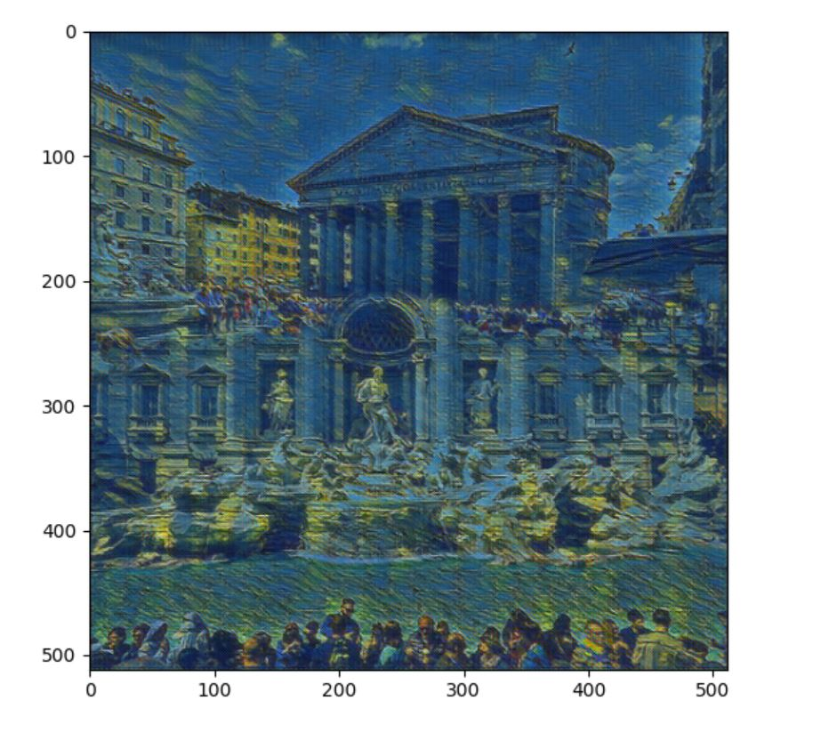

# Neural style Video !!

- With transformer network.

Mix two images!

Result

- Videos

Input video name is set to 'input.avi'

`python video.py`

- License

Copyright (c) 2018 Rusty Mina. Free for academic or research use, as long as proper attribution is given and this copyright notice is retained.
